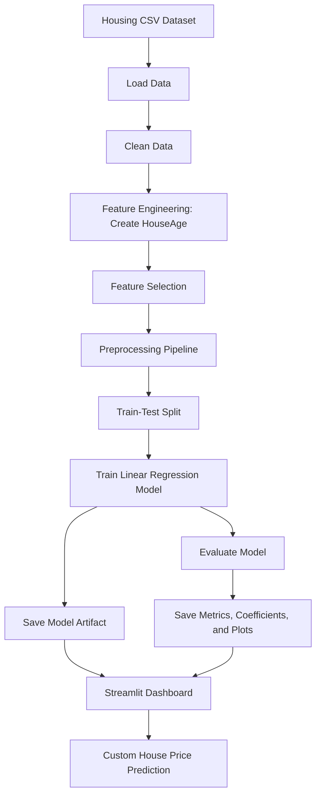
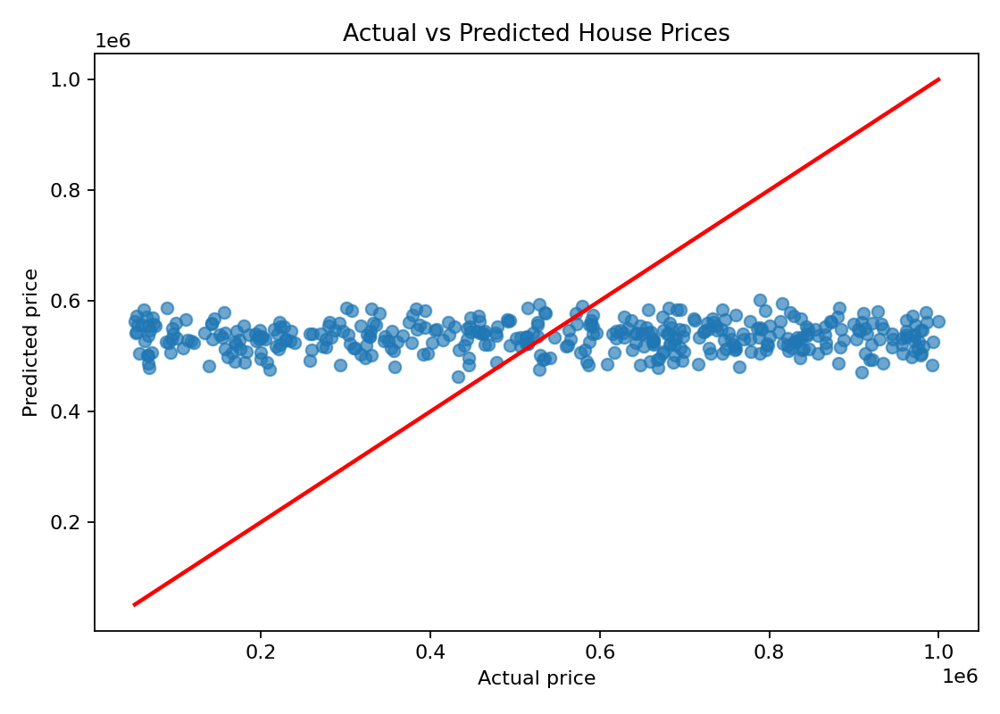
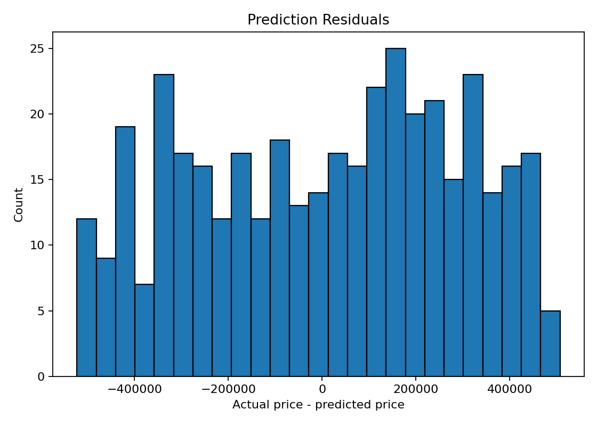

# House Price Prediction using Machine Learning

## Description

This project predicts house prices using a complete machine learning workflow built with Python, Scikit-learn, and Streamlit. It loads a housing dataset, cleans and prepares the data, selects useful features, trains a Linear Regression model, evaluates the model using standard regression metrics, saves the trained model, and provides an interactive dashboard for viewing results and making predictions.

The project is structured as an interview-ready machine learning project because it demonstrates the full lifecycle of a regression problem: data loading, preprocessing, exploratory outputs, feature engineering, train-test split, model training, evaluation, model saving, coefficient interpretation, and deployment through a simple web dashboard.

## Live Demo

Try the deployed Streamlit dashboard here:

[House Price Prediction Live Demo](https://syntecxapphouse-price-prediction-pfaqedd7tj7yf2xuxwgwf3.streamlit.app/)

## What Is House Price Prediction

House price prediction is a regression task where a machine learning model estimates the selling price of a house based on input features such as area, number of bedrooms, bathrooms, floors, construction year, location, condition, and garage availability.

In this project, a Linear Regression model is used to understand how selected housing features relate to price and to produce example predictions for new houses.

## Objectives

- Load and understand the housing dataset.
- Clean the dataset and prepare it for machine learning.
- Engineer a useful `HouseAge` feature from `YearBuilt`.
- Select numerical and categorical features for training.
- Split the data into training and testing sets.
- Train a Linear Regression model.
- Evaluate the model using RMSE, MAE, and R-squared.
- Interpret model coefficients.
- Save the trained model as a reusable artifact.
- Build a Streamlit dashboard for visual output and custom predictions.

## Technologies Used

- Python
- Pandas
- NumPy
- Scikit-learn
- Matplotlib
- Streamlit
- Joblib
- Git and GitHub

## Dataset Information

- Dataset file: `data/house_prices.csv`
- Total records: `2,000`
- Target column: `Price`
- Problem type: Regression

### Dataset Columns

| Column | Description |
| --- | --- |
| `Id` | Unique row identifier |
| `Area` | House area |
| `Bedrooms` | Number of bedrooms |
| `Bathrooms` | Number of bathrooms |
| `Floors` | Number of floors |
| `YearBuilt` | Year the house was built |
| `Location` | Area type such as Downtown, Rural, Suburban, or Urban |
| `Condition` | House condition such as Excellent, Good, Fair, or Poor |
| `Garage` | Whether the house has a garage |
| `Price` | Target price to predict |

## How It Works

1. The dataset is loaded from `data/house_prices.csv`.
2. Duplicate rows, blank values, and invalid numeric values are handled.
3. Categorical values are normalized for consistent formatting.
4. `HouseAge` is created from `YearBuilt`.
5. Selected numerical and categorical features are separated from the target.
6. Missing numerical values are imputed with the median.
7. Missing categorical values are imputed with the most frequent value.
8. Categorical features are converted into numerical columns using one-hot encoding.
9. The dataset is split into training and testing sets.
10. A Linear Regression model is trained.
11. Model performance is evaluated using RMSE, MAE, and R-squared.
12. The model, metrics, coefficients, plots, and example predictions are saved.
13. The Streamlit dashboard displays the results and accepts custom prediction inputs.

## Project Workflow



## Machine Learning Model

### Model Used

- Linear Regression

### Selected Features

```text
Area, Bedrooms, Bathrooms, Floors, HouseAge, Location, Condition, Garage
```

### Preprocessing

- Numerical features: median imputation
- Categorical features: most frequent value imputation
- Categorical encoding: one-hot encoding
- Target variable: `Price`
- Train-test split: 80 percent training, 20 percent testing

## Results

Latest saved model metrics:

| Metric | Value |
| --- | ---: |
| Rows after cleaning | 2,000 |
| Training rows | 1,600 |
| Testing rows | 400 |
| RMSE | 279,859.73 |
| MAE | 243,241.98 |
| R-squared | -0.0067 |

### Metric Interpretation

- RMSE shows the typical prediction error size in the same unit as the house price.
- MAE shows the average absolute prediction error.
- R-squared shows how much price variation is explained by the selected features.
- The current R-squared is low, which suggests this dataset does not contain a strong linear relationship between the selected features and price. This is still useful for demonstrating a complete ML pipeline, and model improvement is listed in the future scope.

## Coefficient Interpretation

The project saves model coefficients in `reports/coefficients.csv` and summarizes the strongest positive and negative coefficients in `reports/model_summary.md`.

### Strongest Positive Coefficients

| Feature | Coefficient |
| --- | ---: |
| `Condition_Fair` | 24,083.31 |
| `Floors` | 23,727.98 |
| `Location_Suburban` | 11,511.99 |
| `Condition_Poor` | 4,073.27 |
| `Garage_Yes` | 2,373.53 |

### Strongest Negative Coefficients

| Feature | Coefficient |
| --- | ---: |
| `Condition_Good` | -12,941.04 |
| `Location_Urban` | -12,718.92 |
| `Bathrooms` | -9,662.25 |
| `HouseAge` | -117.61 |
| `Area` | -0.58 |

Note: categorical coefficients compare each category against the baseline category that is dropped during one-hot encoding.

## Dashboard Output

The Streamlit dashboard in `app.py` includes:

- Cleaned dataset preview
- Dataset summary statistics
- Area vs price chart
- RMSE and R-squared metrics
- Coefficient table and chart
- Example predictions
- Actual vs predicted plot
- Residual plot
- Custom input form for predicting a house price

### Generated Figures

Actual vs predicted output:



Residual distribution:



## Project Structure

```text
House price prediction/
|-- app.py
|-- data/
|   `-- house_prices.csv
|-- models/
|   `-- house_price_linear_regression.joblib
|-- reports/
|   |-- cleaned_house_prices.csv
|   |-- coefficients.csv
|   |-- example_predictions.csv
|   |-- metrics.json
|   |-- model_summary.md
|   `-- figures/
|       |-- actual_vs_predicted.png
|       `-- residuals.png
|-- src/
|   |-- data_processing.py
|   |-- predict.py
|   `-- train_model.py
|-- requirements.txt
|-- README.md
`-- .gitignore
```

## Requirements

- Python 3.10 or later
- pip
- VS Code or any Python IDE

## Installation and Setup

Clone the repository:

```bash
git clone https://github.com/LOKESHBOOTU/Syntecxhub_house-price-prediction.git
cd Syntecxhub_house-price-prediction
```

Create and activate a virtual environment:

```powershell
python -m venv .venv
.\.venv\Scripts\Activate.ps1
```

If PowerShell blocks activation, run:

```powershell
Set-ExecutionPolicy -Scope Process -ExecutionPolicy Bypass
.\.venv\Scripts\Activate.ps1
```

Install dependencies:

```powershell
python -m pip install --upgrade pip
python -m pip install -r requirements.txt
```

## Train the Model

```powershell
python src\train_model.py
```

After training, these files are generated or updated:

- `models/house_price_linear_regression.joblib`
- `reports/metrics.json`
- `reports/coefficients.csv`
- `reports/model_summary.md`
- `reports/example_predictions.csv`
- `reports/figures/actual_vs_predicted.png`
- `reports/figures/residuals.png`

## Run the Dashboard

```powershell
streamlit run app.py
```

If `streamlit` is not recognized, run:

```powershell
python -m streamlit run app.py
```

Open the local dashboard URL in the browser:

```text
http://localhost:8501
```

## Make Predictions from Terminal

Run built-in sample predictions:

```powershell
python src\predict.py
```

Predict from a custom CSV:

```powershell
python src\predict.py --input data\new_houses.csv --output reports\new_predictions.csv
```

The custom CSV should include:

```text
Area,Bedrooms,Bathrooms,Floors,YearBuilt,Location,Condition,Garage
```

## Features

- Complete regression machine learning workflow
- Reusable data cleaning and preprocessing code
- Linear Regression model with saved artifact
- RMSE, MAE, and R-squared evaluation
- Coefficient interpretation for model explainability
- Generated plots for actual vs predicted values and residuals
- Streamlit dashboard for interactive viewing and prediction
- GitHub-ready structure for portfolio and interview presentation

## Applications

- Demonstrating regression modeling in machine learning interviews
- Understanding how housing features can be used for price prediction
- Practicing data preprocessing and feature engineering
- Building a simple ML dashboard with Streamlit
- Creating a portfolio-ready end-to-end ML project

## Limitations

- Linear Regression may not capture complex non-linear pricing patterns.
- The current dataset shows weak linear predictive signal based on the saved R-squared score.
- Model performance depends heavily on dataset quality and feature relevance.
- The project is designed for learning, demonstration, and portfolio presentation, not real estate production pricing.

## Future Improvements

- Add Exploratory Data Analysis charts for all features.
- Compare Linear Regression with Random Forest, XGBoost, Ridge, and Lasso Regression.
- Add hyperparameter tuning and cross-validation.
- Improve feature engineering with price per square foot, location scoring, and age buckets.
- Add a model comparison table in the dashboard.
- Deploy the Streamlit app on Streamlit Community Cloud, Render, or Hugging Face Spaces.

## Interview Talking Points

- This is an end-to-end regression project, not only a notebook.
- The preprocessing and model are saved together using a Scikit-learn pipeline.
- The project separates data processing, training, prediction, and dashboard code.
- The README includes clear setup steps, results, and model limitations.
- The low R-squared is acknowledged honestly, showing good model evaluation judgment.

## Author

- Lokesh Bootu
- GitHub: [LOKESHBOOTU](https://github.com/LOKESHBOOTU)

## License

No license file has been added yet. For open-source use, adding an MIT License is recommended.
